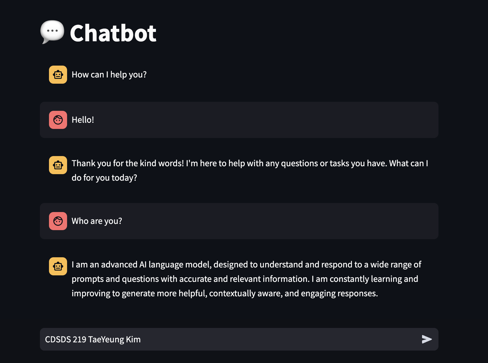

## TaeYeung Kim - Assignment 7

### I ran the Chatbot

Here is my Chatbot Screenshot

#### What went well

Since I have downloaded the model in class, I was able to download this chatbot recipe very fast. 

#### What didn't go well

I had to wait several minutes to open the chatbot due to "Checking Model Service Availablity".

However, this issue was resolved when I redownloaded the chatbot recipe in podman desktop.
