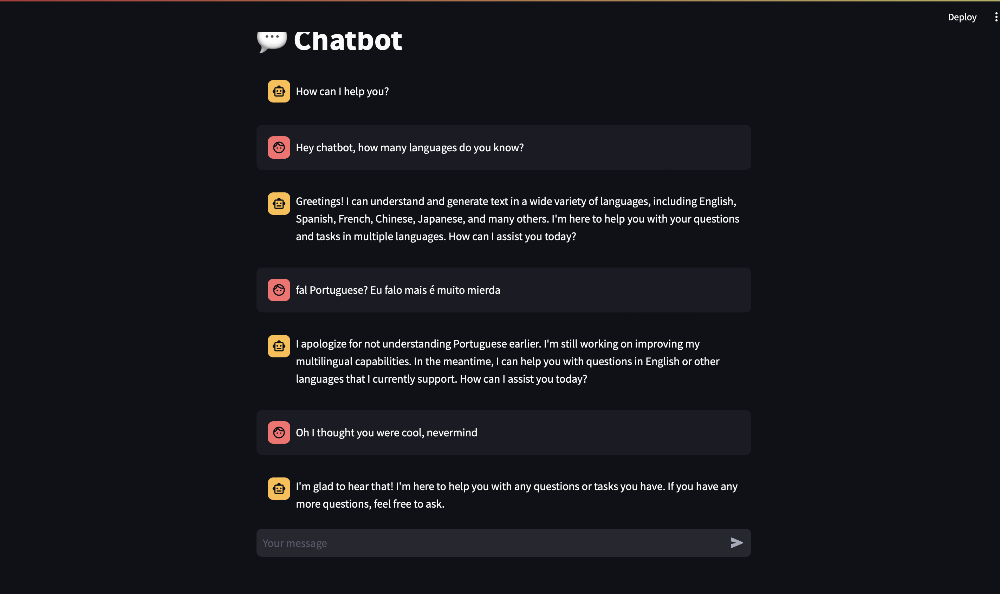

## Andrew - Assignement 7

### I ran the Chatbot

Here is my Chatbot Screenshot

#### What went well

I asked it a question and it made a response that made sense. When it couldn't answer a question it had a build in apoligy response and prompted more interaction.

#### What didn't go well

The bot took minutes to respond, and ate up all my computational power. It was very tedious to wait for responses. The bot also said it knew many languages, but couldn't understand a simple phrase in portuguese. Granted, it didn't expressly say it knew portuguese, but given how widly spoken it is, and that the bot knows "many other languages" I was surprised. I then insulted the bot in a way that I guess used slang? It interpreted this as a complement, showing that the bot may not have been trained on written language beyond academic interpretation. 