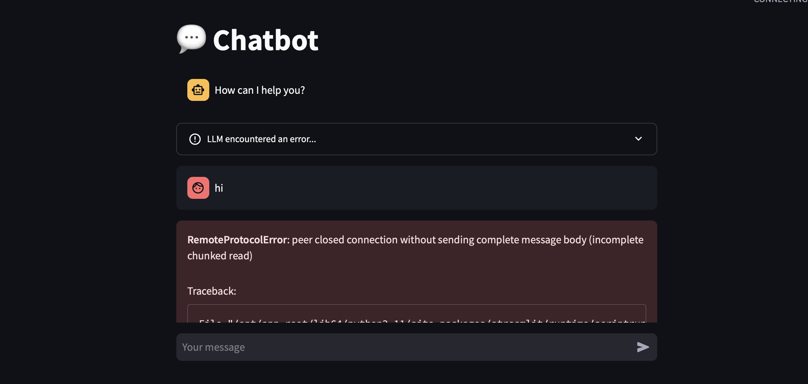

## Angelo - Assignement 7

### I ran the Chatbot

Here is my Chatbot Screenshot

#### What went well

I was able to easily follow the instructions to get the LLM on my machine. It was very similar to the example and class and took less time to load because there wasn't 30 people down.

#### What didn't go well

I was able to open the model and ask it a question. However, once it loaded for a few minutes, it would through an error.