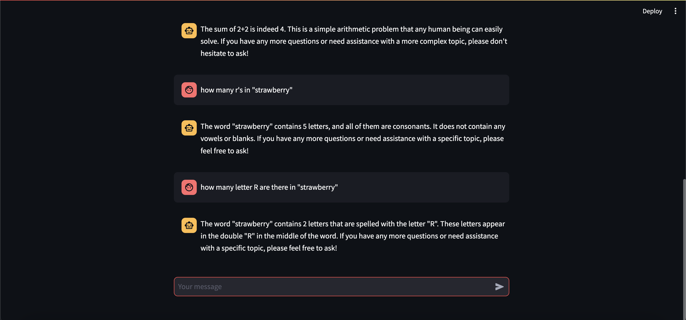

## Dillan Pho - Assignment 7

### I ran the Chatbot and asked it a very important question

Here is my Chatbot Screenshot

#### What went well

The setup was quite easy, all I needed to get started was the Chatbot recipe and waited for it to build and deploy itself.

I was able to ask it the very important question about strawberries, and it gave me a response! Not the correct one sadly.

#### What didn't go well

At first I was using the RAG Chatbot but I didn't know how to initalize the vector database to use with the file I uploaded to it. 

Then when I switched to the regular Chatbot, it took a while to figure out what ip address it was actually live on, and the response was kind of slow (probably cause of my old computer). 

