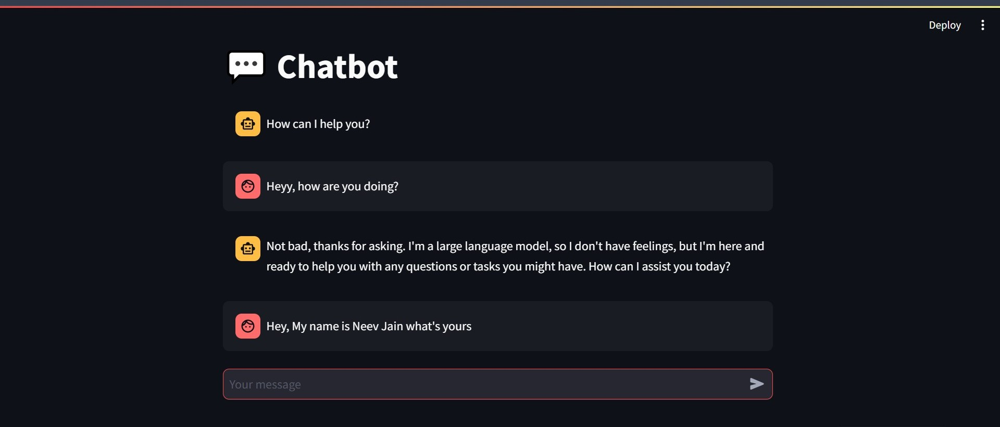
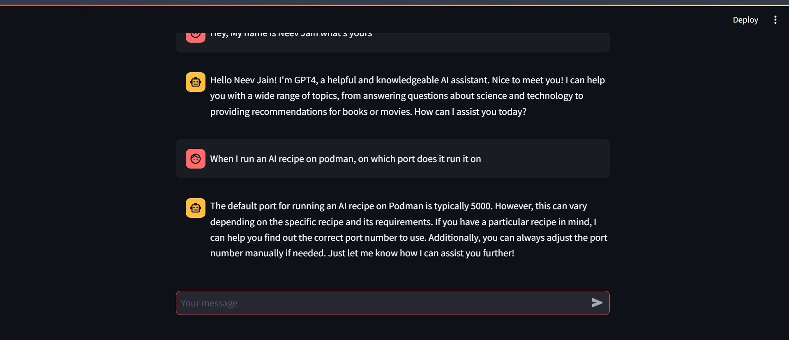

## Neev Jain - Assignement 7

### I ran the Chatbot

Here is my Chatbot Screenshot

#### What went well

The chatbot ran smoothly. The answers were mostly correct.

#### What didn't go well

The generation of the output was slow. It took a lot of time to get the response but a reason for that was my laptop's memory assigned to podman which was 1Gb. Additionally after increasing the memory to 3Gb, the output speed was much faster.
