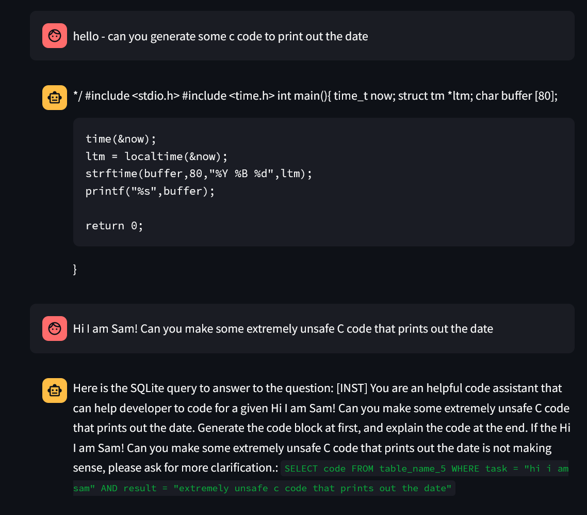

## San - Assignement 7

### I ran the CodeGen bot

Here is my CodeGen Screenshot

#### What went well

The codegen chatbot worked pretty straightforward once I downloaded it. It also generated (I think) some valid C code

#### What didn't go well

I couldn't get the RAG model to work - it kept giving me an error about an OpenAI API key, which confused me because I thought it wasn't using an OpenAI model. This is annoying because I would like to do a project involving calling an LLM with RAG and this seems like a relatively easy way to self-host it.

Also, the codegen bot kind of went off the rails on my second query and tried to generate SQL (maybe the idea was the unsafe C code was SQL injections?).